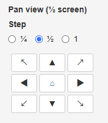
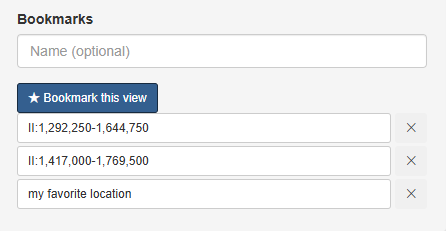
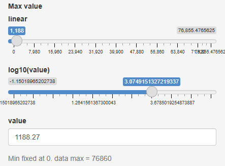
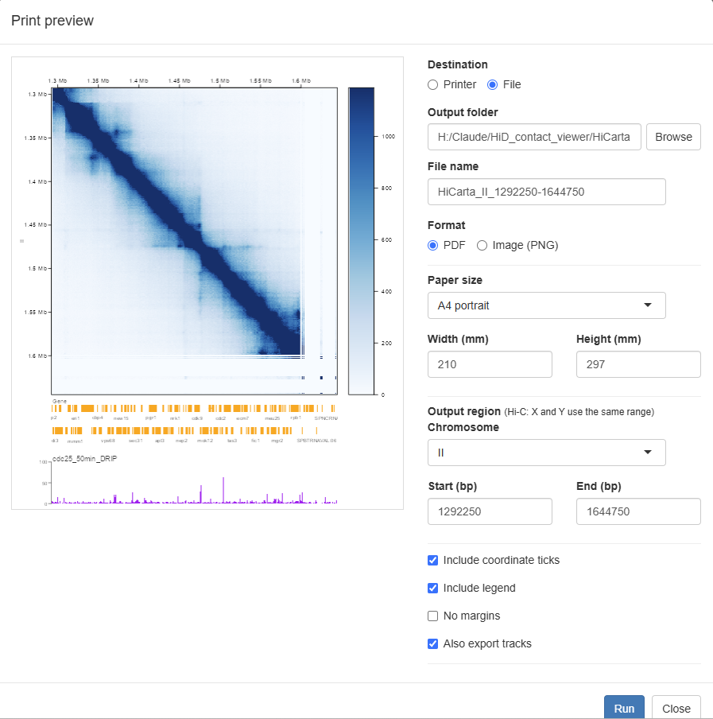

# Usage

A shortest-path operation guide you can browse by "what you want to do". For what the finer options mean, see **[Screens & controls](interface.md)**, linked from each item.

To start with, the overall flow is all you need to remember: **load data → open the map → move around to view it**. That's it.

---

## Loading data

Data is loaded from the loader that opens when you click the **Data** button at the top of the screen (three tabs: "Hi-C", "Tracks" and "Session").

### Load a Hi-C map {#load-hic}

1. Click the **Data** button at the top.
2. On the **Hi-C** tab, click **Load menu** and choose a sample and dataset, or enter the path of a `.hic` file on your computer in **local .hic file** (**Browse…** also works).
3. Click **Open map**.

→ Details: [Screens & controls - Data](interface.md#data)

### Load a bigWig {#load-bigwig}

1. Open a Hi-C map first (tracks are drawn on the map's coordinates).
2. Open the **Data** button → **Tracks** tab.
3. Enter the bigWig path or URL in **bigWig/BED file/URL** (**Browse…** also works).
4. Set **Type** to "bigWig" and click **Add track**.

→ Details: [Screens & controls - Tracks](interface.md#tracks)

### Load Border Strength {#load-bs}

1. Open a Hi-C map first.
2. Open the **Data** button → **Tracks** tab.
3. Enter the path or URL of the Border Strength file (`*_BS.txt`) in the file field.
4. Set **Type** to "Border Strength" and click **Add track**.

Positive values are drawn in red, negative values in blue, and boundaries are marked with dashed lines. For the file format, see **[Data formats](data-formats.md)**.

→ Details: [Screens & controls - Tracks](interface.md#tracks)

### Load genes / BED {#load-other}

On the **Tracks** tab, enter a path or URL in the file field, set **Type** to "gene (GFF3)" or "BED", and click **Add track**. If an IGV XML or track list is available, you can also add tracks via **Load** at the top, choosing XML file → Category → Track.

→ Details: [Screens & controls - Tracks](interface.md#tracks)

---

## Moving around the region shown

Navigation controls are gathered in the **Navigate** menu on the left of the screen.

### Move to any location {#goto}

1. Choose **Navigate** in the top menu.
2. Choose a **Chromosome**, and enter the range you want in **Y-axis start** and **Y-axis end** (bp).
3. Click **Go to region**.

→ Details: [Screens & controls - Navigate](interface.md#navigate)

### Move with buttons {#pan}

Use the direction pad in the **Navigate** menu (up/down/left/right plus diagonals) to move the map. The step per click is set with **Step** (¼ · ½ · 1 screen). You can also drag directly on the map, or scroll to zoom.

→ Details: [Screens & controls - Navigate](interface.md#navigate)

### Show the whole chromosome {#whole}

Click the button in the center of the direction pad (⌂) in the **Navigate** menu to return to the whole-chromosome view.

→ Details: [Screens & controls - Navigate](interface.md#navigate)

### Bookmark a region of interest {#bookmark}

1. Display the region you want to bookmark.
2. If you like, enter a name in the name field at the bottom of the **Navigate** menu (optional).
3. Click **★ Bookmark this view**.

Saved bookmarks appear in a list; click one to return to that view at any time. Remove one you no longer need with **Delete**.

→ Details: [Screens & controls - Navigate](interface.md#navigate)

---

## Adjusting the appearance

### Change the contrast (color intensity) {#contrast}

Choose **Display** in the top menu and drag the **Max value** slider to change the contrast. Switching between **linear / log10** and choosing a **Palette** are also done here.

→ Details: [Screens & controls - Display](interface.md#display)

### Adjust map height and layout {#layout}

In **Setting** in the top menu, you can set the **Contact map height**, spread it full-screen with **Fit to window**, and adjust track heights and resolution.

→ Details: [Screens & controls - Setting](interface.md#setting)

---

## Saving and exporting

### Save the view and reproduce it later (session) {#session}

**To save:**

1. Open the **Data** button → **Session** tab.
2. Click **Save current view** to download a `.json` file.

**To restore:**

1. Open the **Data** button → **Session** tab.
2. In **Restore from file (.json)**, choose the `.json` you saved.

The data source, region, color scale and all tracks are restored together.

→ Details: [Screens & controls - Data (Session)](interface.md#data)

### Export as an image / print {#print}

1. Open the map you want to export.
2. Choose **Print** in the top menu and click **Open print preview**.
3. In the preview, set the destination (Printer / File), format (PNG / PDF), paper size, output region, whether to include coordinate ticks, the legend and margins, and whether to include tracks.
4. Click **Run**.

→ Details: [Screens & controls - Print](interface.md#print)

---

## Other

### Switch the display language {#language}

Open **Setting → Edit config file…** in the top menu, choose the **Interface language**, and click **Apply & save**. The page reloads and the language switches. Because any open map and tracks are closed when this happens, use the [session save feature](#session) if you want to return to the same state.

→ Details: [Screens & controls - Setting](interface.md#setting)
