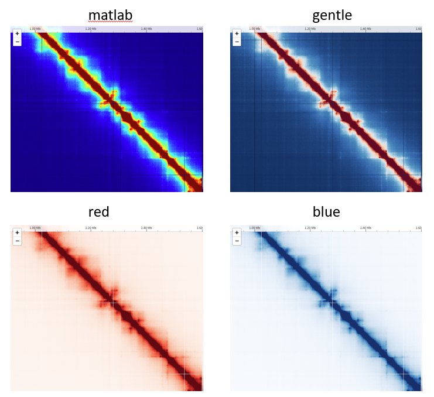

# HiCarta でできること

HiCarta でできることの一覧です。各項目の具体的な操作手順は **[使い方](usage.md)** の該当箇所にリンクしています。

## データの読み込み

### Hi-C コンタクトマップを地図のように見る

Hi-C コンタクトマップを、地図アプリと同じ感覚で操作できます。ドラッグで移動、スクロールでズームでき、表示している部分のタイルだけを読み込むため、高解像度のマップや大きなゲノムでも軽快に動きます。ズームに応じて解像度が自動で切り替わります。

→ [Hi-C マップを読み込む](usage.md#load-hic)

### `.hic` ファイルを直接読み込む

Juicer 形式の `.hic` を直接読み込めます。あらかじめ用意したメニューからサンプル・データセット・正規化・解像度を選ぶことも、パソコン内のローカル `.hic` ファイルを指定することもできます。

→ [Hi-C マップを読み込む](usage.md#load-hic)

### 1 次元トラックを重ねて表示する

コンタクトマップの下に、bigWig（定量シグナル）、BED（区間）、遺伝子モデル（GFF3 形式）、Border Strength（TAD などのドメイン境界の強度）を重ねて表示できます。トラックはマップの横方向の移動・ズームに追従し、複数を積み重ねられます。

→ [bigWig を読み込む](usage.md#load-bigwig) ・ [Border Strength を読み込む](usage.md#load-bs) ・ [遺伝子・BED を読み込む](usage.md#load-other)

### セッションを保存する

データ元・領域・カラースケール・すべてのトラックを含む「表示全体」を 1 つのファイル（`.json`）に保存できます。後で読み込むと、まったく同じ表示を再現できます。解析結果を保存したり、他の人と共有したりするのに使えます。ブックマークも一緒に保存されるので、解析を再開するときに便利です。

→ [表示状態を保存して後で再現する](usage.md#session)

## 移動

### 任意の場所へ移動する

染色体の名前と Y 軸範囲を入力して、見たい領域へ一発でジャンプできます。

→ [任意の場所に移動する](usage.md#goto)

### ボタンで移動する

上下左右・斜めの 8 方向ボタンで、マップを 1 画面ずつ（移動量は ¼・½・1 から選択）動かせます。中央のボタンで染色体全体の表示に戻れます。

→ [ボタンで移動する](usage.md#pan)

### ブックマーク機能

今見ている表示（領域）に名前を付けて保存し、あとからワンクリックで同じ場所に戻れます。何度も見返したい領域を登録しておくのに便利です。

→ [気になる場所をブックマークする](usage.md#bookmark)

## 見た目の調整

### コンタクトマップのカラースケールを調整する

Hi-C コンタクトマップの色は、4 つのカラーパレット（matlab, gentle, red, blue）の中からお好きなものを選べます。コンタクトマップの最大値をインタラクティブに変更すると、見え方の変化をその場で確かめられます。最大値は、線形または log10 のスライダーで調整するか、直接数値を入力して変更できます。

→ [色の濃さ（コントラスト）を変える](usage.md#contrast)

### トラックの色や高さ、名前を調整する

bigWig・遺伝子・BED・Border Strength などのトラックは、それぞれに好きな名前を付け、高さを調整したり、色を変更したりできます。Y 軸の最大値は、自動モードか固定値のどちらかに設定できます。また、トラックの描画解像度をインタラクティブに調整できるため、Hi-C コンタクトマップの解像度に合わせて ChIP-seq のピークを見る、といったことも可能です。

→ [トラックの詳細設定（画面と操作の説明）](interface.md#tracks)

### 論文に使える高品質な画像として出力・印刷する

現在開いているマップの指定領域を、PNG 画像または PDF として出力できます。プレビュー画面で確認しながら出力する領域を選び、続けて出力していくことができます。また、座標目盛・凡例・トラックを出力に含めるかどうかを選べます。論文用には、余白無しオプションでコンタクトマップだけを出力し、ご自身で編集することもできます。プリンターへ直接印刷することもできます。

→ [画像として出力する・印刷する](usage.md#print)

### 出力するパネルの高さを調整する

Hi-C コンタクトマップの高さは、自分で数値を指定して調整することも、画面の表示エリアに合わせて自動で調整することもできます。また、各トラックの高さは、それぞれ別々に調整できます。

→ [マップの高さやレイアウトを整える](usage.md#layout)

## 高速な読み込み

インターネット上の `.hic` や bigWig は、初回に一度だけローカルにダウンロードして保存します。次回以降はそのキャッシュから読み込むため、非常に高速に動作します。

→ [Hi-C マップを読み込む](usage.md#load-hic)

## 表示言語を切り替える

インターフェースの言語を、日本語と英語で切り替えられます。

→ [表示言語を切り替える](usage.md#language)

---

各機能を画面のどこで操作するか、細かいオプションの意味は **[画面と操作の説明](interface.md)** にまとめています。
