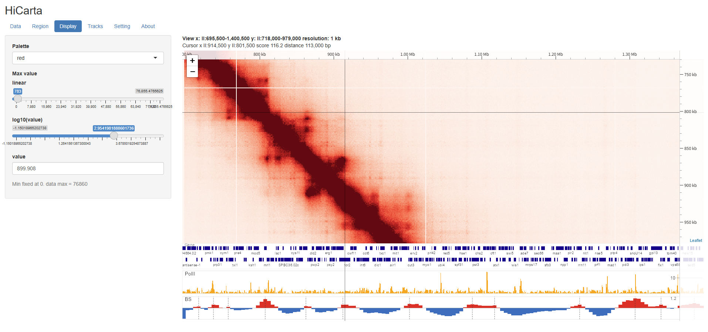

# HiCarta

R + Shiny + Leaflet で作られた、**インタラクティブな Hi-C コンタクトマップビューアー**です。

HiCarta は Hi-C コンタクトマップを Google mapのように操作できます — **ドラッグで移動、スクロールでズーム**。表示中のタイルだけを読み込むため、高解像度マップや大きなゲノムでも軽快に動作します。`.hic` ファイルを直接読み込み、1次元トラック（bigWig、BED、遺伝子モデル、Border Strength）を重ねて表示できます。

- :material-download: **[インストール](install.md)** — R の導入とアプリの起動
- :material-book-open-variant: **[使い方](usage.md)** — データの読み込み、操作、トラックの追加
- :material-file-table: **[データ形式](data-formats.md)** — `.hic`、トラック、hic200 の変換

## できること

- `.hic`（Juicer）を `strawr` によるランダムアクセスで読み込み、ズームに応じて解像度を切り替えます（レベル・オブ・ディテール）。
- 256 px のタイルを必要に応じて描画し、単一の絶対カラースケールでタイルを継ぎ目なく表示します。
- リモートの `.hic` / bigWig は初回オープン後にローカルへキャッシュし、次回以降を高速化します。
- マップに同期する1次元トラック（bigWig、BED、遺伝子モデル（GFF3）、Border Strength）を重ねて表示します。

## クイックスタート

1. <https://cran.r-project.org> から R（4.1 以上）をインストールします。
2. `git clone https://github.com/rafysta/HiCarta.git`
3. `run_windows.bat`（Windows）または `run_mac.command`（macOS）をダブルクリックします。初回起動時に必要な R パッケージが自動インストールされます。
4. ブラウザのタブが `http://127.0.0.1:7788` で開きます。

詳細は **[インストール](install.md)** を参照してください。

---

作者: **谷澤 英樹（Hideki Tanizawa）**（<rafysta@gmail.com>）
ソース: [github.com/rafysta/HiCarta](https://github.com/rafysta/HiCarta) ·
MIT ライセンスで公開。
