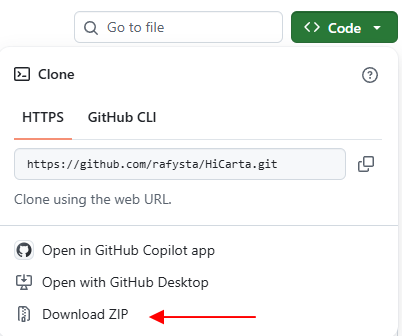

# HiCarta

**インタラクティブな Hi-C コンタクトマップビューアー**です。「Carta」はイタリア語やラテン語で「海図」を意味する言葉で、Hi-C コンタクトマップを自由に移動して描画するという意味を込めた名前です。

{ width="697" }

HiCarta は Hi-C コンタクトマップを Google マップのように操作できます — **ドラッグで移動、スクロールでズーム**。表示中のタイルだけを読み込むため、高解像度マップや大きなゲノムでも軽快に動作します。`.hic` ファイルを直接読み込み、1 次元トラック（bigWig、BED、遺伝子モデル、Border Strength）を重ねて表示できます。

- :material-download: **[インストール](install.md)** — 3 ステップで起動（Windows）
- :material-star-four-points: **[できること](features.md)** — HiCarta の全機能一覧
- :material-book-open-variant: **[使い方](usage.md)** — やりたいこと別の操作ガイド
- :material-view-dashboard-outline: **[画面と操作の説明](interface.md)** — 各メニューの詳細
- :material-file-table: **[データ形式](data-formats.md)** — `.hic`、トラック、hic200 の変換

## できることの例

- `.hic`（Juicer 形式）を読み込み、ズームに応じて解像度を切り替えます（レベル・オブ・ディテール）。
- マップに同期する 1 次元トラック（bigWig、BED、遺伝子モデル（GFF3）、Border Strength）を複数個重ねて表示します。
- 気になる領域をブックマークしたり、表示全体をセッションとして保存・復元できます。
- 指定領域を、論文に出力できる高品質の画像（PNG / PDF）として出力・印刷できます。

すべての機能は **[できること](features.md)** を参照してください。

## クイックスタート（Windows）

1. <https://cran.r-project.org> から R（4.1 以上）をインストールします。
2. [GitHub](https://github.com/rafysta/HiCarta) で **Code → Download ZIP** から入手し、展開します。

    { width="400" }

3. `run_windows.bat` をダブルクリックします。初回起動時に必要な R パッケージが自動でインストールされます。
4. 既定のブラウザでアプリが起動します。

詳細は **[インストール](install.md)** を、Mac や手動インストールは **[セットアップ詳細](setup-details.md)** を参照してください。

---

作者: **谷澤 英樹（Hideki Tanizawa）**（<rafysta@gmail.com>）
ソース: [github.com/rafysta/HiCarta](https://github.com/rafysta/HiCarta) ·
MIT ライセンスで公開。
