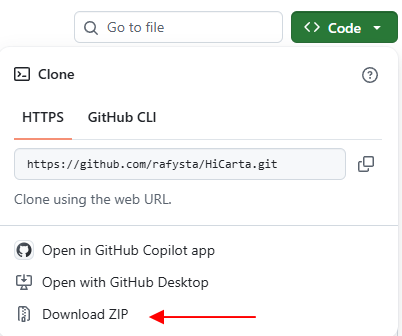

# セットアップ詳細・トラブルシューティング

このページは、**[インストール](install.md)** の 3 ステップで足りなかったときのための、詳しい情報とトラブル対処をまとめたものです。ふつうに起動できている場合、ここを読む必要はありません。

## Git を使って入手する（ZIP の代わり）

ZIP のダウンロードの代わりに、Git がインストールされていれば次のコマンドでも入手できます。更新を取り込みやすくなります。

```
git clone https://github.com/rafysta/HiCarta.git
```

## Mac で起動する

Mac でも動作します。

1. <https://cran.r-project.org> から R（4.1 以上）をインストールします（CRAN の `.pkg`、または `brew install --cask r`）。
2. HiCarta を ZIP でダウンロードして展開します。

    { width="400" }

3. フォルダ内の **`run_mac.command`** をダブルクリックします。

「開発元を検証できないため開けません」と表示されて開けない場合は、`run_mac.command` を **右クリック →「開く」** を選ぶと起動できます。または一度だけターミナルで次を実行してください。

```
chmod +x run_mac.command
```

アプリを止めるときは、ターミナルのウィンドウで `Ctrl+C` を押すか、ウィンドウを閉じます。

## 必要な R パッケージ

初回起動時、ランチャーが不足しているパッケージを確認し、必要に応じて `R/install_libraries.R` を実行して自動でインストールします。内訳は次のとおりです。

| パッケージ | 入手元 | 用途 |
|---|---|---|
| shiny, leaflet, htmlwidgets, base64enc | CRAN | アプリ本体 + タイル表示 |
| data.table | CRAN | 高速なテキスト読み込み |
| RColorBrewer | CRAN | カラーパレット |
| jsonlite | CRAN | セッションの保存・復元 |
| shinyFiles | CRAN | ローカルファイルの「参照…」ダイアログ |
| curl | CRAN | リモート `.hic` / bigWig の HTTP レンジ読み込み |
| strawr | CRAN | *任意*。`.hic` の予備リーダー。通常は不要 |
| rtracklayer | Bioconductor | BED トラック（bigWig は内蔵リーダーが読みます） |

!!! note "rtracklayer は時間がかかります"
    `rtracklayer` は Bioconductor 由来のため、初回のインストールに数分かかることがあります。これは正常です。

パッケージを手動でまとめてインストールしたい場合にのみ、R を起動して次を実行します。

```r
source("R/install_libraries.R")
```

## 起動と停止のしくみ

アプリはブラウザのタブを `http://127.0.0.1:7788` で開きます。停止するには、Windows ではランチャーのウィンドウ（コマンドプロンプト）を閉じ、macOS ではターミナルで `Ctrl+C` を押すかウィンドウを閉じます。ポート 7788 がすでに使われている場合、ランチャーが以前のインスタンスを自動的に終了してから起動します。

---

## トラブルシューティング

### 「Could not find Rscript」と表示される

R がインストールされていないか、`PATH` に登録されていない状態です。R をインストールしてから起動し直してください。Windows ではランチャーが `C:\Program Files\R\` も自動で探します。

### `rtracklayer` のインストールに失敗する

初回起動時にインターネットに接続されていることを確認してください。うまくいかない場合は、R を起動して直接インストールできます。

```r
if (!requireNamespace("BiocManager", quietly = TRUE)) install.packages("BiocManager")
BiocManager::install("rtracklayer")
```

### 何も表示されない／マップが真っ白

**Data**（データ）でデータセットが読み込まれ、**移動** で領域が設定されているかを確認し、**マップを開く** をクリックしてください。

### リモートの `.hic` やトラックが遅い

リモートの `.hic` は**ストリーミング**で読み込みます。表示中の領域だけを HTTP レンジリクエストで取得し、接続は 1 本を使い回します。ディスクには何も書きません。一度表示した領域の中でのパン・ズームはメモリから描かれるため、通信は発生しません。

回線が遅い・不安定な場合は、ファイル全体を一度ダウンロードするほうが快適なことがあります。**設定 → 設定ファイルを編集… → リモートファイルの読み込み方式** で切り替えられます。`config.txt` に直接書いても構いません:

```
hic_engine = download     # 先にファイル全体を _hic_cache/ に取得する
hic_engine = native       # ストリーミング（既定）
```

この設定は **bigWig トラックにも適用されます**。rtracklayer はリモートの bigWig を開くことができない（`Couldn't open ... UCSC library operation failed`）ため、HiCarta は独自のストリーミングリーダーで読み込みます。BED・GFF3・Border Strength のトラックはファイル全体を解析する必要があるため、この設定に関係なく常にダウンロードされます。

`download` の場合、ファイルは `_hic_cache/` に溜まります。空き容量が必要になれば削除して構いません（必要なときに再取得されます）。

3 番目の値として `strawr` があります。これは旧来の [strawr](https://cran.r-project.org/package=strawr) リーダーを使うもので、診断用です。URL に対しては非常に遅くなります（`strawr::readHicNormTypes()` に HTTP のコードパスが無く、1 回の呼び出しで約 30 秒 CPU を空転させたうえ、正規化の一覧を取りこぼします）。

### 起動時の既定値を変えたい（config.txt）

メニュー URL・トラックリスト・表示言語などの既定値は、アプリと同じフォルダの `config.txt` に保存されます。アプリ内の **設定 → 設定ファイルを編集…** から編集できます（詳細は **[画面と操作の説明](interface.md)** を参照）。手動で編集する場合は、`config.example.txt` を `config.txt` にコピーして書き換えます。
