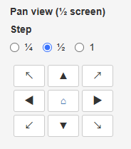
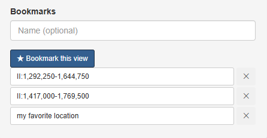
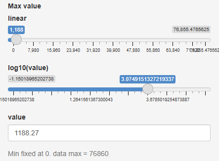
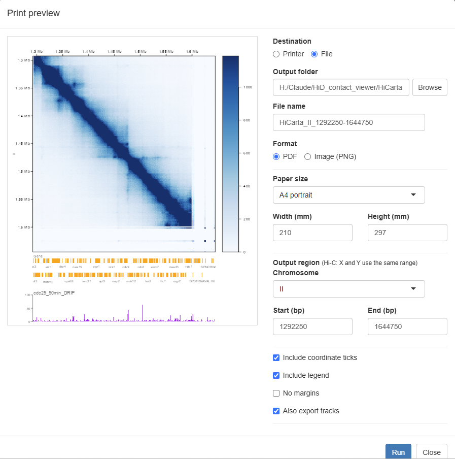

# 使い方

「やりたいこと」から探せる、最短の操作ガイドです。細かいオプションの意味は、各項目からリンクしている **[画面と操作の説明](interface.md)** を参照してください。

まずは大まかな流れだけ覚えておけば十分です。**データを読み込む → マップを開く → 移動して見る**、これだけです。

---

## データを読み込む

すべてのデータは **[データカタログ](data-catalog.md)**（1 行 = 1 サンプルの Excel ファイル）から読み込みます。画面上部の **データ** ボタンを押すと開く読み込み画面（「Data browser」「セッション」の 2 タブ）を使います。

### Hi-C マップを読み込む {#load-hic}

1. 上部の **データ** ボタンをクリックします。
2. **Data browser** タブでカタログを読み込みます（**読み込み**。欄には `config.txt` の値が入っています。**参照…** でローカルの `.xlsx` も選べます）。
3. サイドバーの絞り込みや検索で目当てのサンプルを探し、その行をクリックします。
4. 詳細表示で **コンタクトマップとして開く** をクリックします。

→ 詳細: [画面と操作の説明 - データ](interface.md#data)、[データカタログ](data-catalog.md)

### bigWig を読み込む {#load-bigwig}

1. **Data browser** で bigWig サンプルの行をクリックします。
2. **トラックとして追加** を押し、ダイアログでラベル・色・高さを調整して追加します。

Hi-C マップを先に開いていれば、トラックはマップの座標に合わせて描かれます。

→ 詳細: [画面と操作の説明 - トラック](interface.md#tracks)

### Hi-C マップなしでトラックだけ見る {#tracks-only}

Hi-C マップを開かずにトラックを追加すると、**最初に追加したトラックのファイルから染色体名と長さを読み取り**、その最初の染色体の全長を表示します（コンタクトマップは非表示のまま）。

- 染色体長は、bigWig はファイルのヘッダから、BED / GFF3 / `*_BS.txt` はデータ中の最大座標から求めます。
- 移動は **移動** パネルで行います：染色体を選ぶとその全長に移動、開始・終了を入れて **領域へ移動**、左右ボタンでパン、**＋ / −** で拡大・縮小。
- ファイルから染色体情報を読み取れない場合はメッセージが出ます。その場合は先に Hi-C マップを開いてください。
- 後から Hi-C マップを開くと、コンタクトマップが現れて通常どおりトラックと連動します。
- **印刷** はトラックだけでも使えます（座標軸＋トラックが出力されます）。

### Border Strength・遺伝子・BED を読み込む {#load-bs}

ほかのトラックと同じです。ファイルにカタログの行を作り（`file_type` を `bs`・`gff3`・`bed` にするか、拡張子からの自動判定に任せます）、**Data browser** でその行をクリックして **トラックとして追加** を選びます。

Border Strength（`*_BS.txt`）は、正の値が赤、負の値が青で描かれ、境界の位置には破線が引かれます。ファイル形式は **[データ形式](data-formats.md)** を参照してください。

→ 詳細: [画面と操作の説明 - トラック](interface.md#tracks)

---

## 表示する領域を移動する

移動の操作は、画面左の **移動** メニューにまとまっています。

### 任意の場所に移動する {#goto}

1. 上部メニューの **移動** を選びます。
2. **染色体** を選び、**Y 軸 開始** と **Y 軸 終了**（bp）に見たい範囲を入力します。
3. **領域へ移動** をクリックします。

→ 詳細: [画面と操作の説明 - 移動](interface.md#navigate)

### ボタンで移動する {#pan}

**移動** メニューの方向パッド（上下左右＋斜めの 8 方向）で、マップを動かせます。1 回の移動量は **移動量**（¼・½・1 画面分）で選べます。マップ上を直接ドラッグしたり、スクロールでズームしたりもできます。

→ 詳細: [画面と操作の説明 - 移動](interface.md#navigate)

### 染色体全体を表示する {#whole}

**移動** メニューの方向パッド中央のボタン（⌂）をクリックすると、その染色体の全体表示に戻ります。

→ 詳細: [画面と操作の説明 - 移動](interface.md#navigate)

### 気になる場所をブックマークする {#bookmark}

1. ブックマークしたい領域を表示した状態にします。
2. **移動** メニュー下部の名前欄に、必要なら名前を入力します（省略可）。
3. **★ この表示を保存** をクリックします。

保存したブックマークは一覧に並び、クリックするといつでもその表示に戻れます。ブックマークは開いていたデータ（正規化・解像度・カラースケール最大値も）を記憶しているので、表示全体が復元されます。不要になったら **削除** で消せます。**Excel に保存** / **Excel から読み込み（追加）** で、一覧を注釈・共有できる `.xlsx` として入出力できます（[詳細](data-catalog.md#ブックマークの-excel-入出力)）。

→ 詳細: [画面と操作の説明 - 移動](interface.md#navigate)

---

## 見た目を調整する

### 色の濃さ（コントラスト）を変える {#contrast}

上部メニューの **表示** を選び、**最大値** のスライダーを動かすとコントラストが変わります。**線形／log10** の切り替えや、**カラーパレット** の選択もここで行います。

→ 詳細: [画面と操作の説明 - 表示](interface.md#display)

### マップの高さやレイアウトを整える {#layout}

上部メニューの **設定** で、**コンタクトマップの高さ** を指定したり、**ウィンドウに合わせる** で画面いっぱいに広げたり、トラックの高さや解像度を調整したりできます。

→ 詳細: [画面と操作の説明 - 設定](interface.md#setting)

---

## 保存・出力する

### 表示状態を保存して後で再現する（セッション） {#session}

**保存する:**

1. 上部の **データ** ボタン → **セッション** タブを開きます。
2. **現在の表示を保存** をクリックすると、`.json` ファイルがダウンロードされます。

**復元する:**

1. **データ** ボタン → **セッション** タブを開きます。
2. **ファイルから復元（.json）** で、保存しておいた `.json` を選びます。

データ元・領域・カラースケール・すべてのトラックがまとめて復元されます。

→ 詳細: [画面と操作の説明 - データ（セッション）](interface.md#data)

### 画像として出力する・印刷する {#print}

1. 出力したいマップを開いておきます。
2. 上部メニューの **印刷** を選び、**印刷プレビューを開く** をクリックします。
3. プレビュー画面で、送信先（プリンター／ファイル）、フォーマット（PNG／PDF）、用紙サイズ、出力領域、座標目盛・凡例・余白の有無、トラックを含めるかを設定します。
4. **実行** をクリックします。

→ 詳細: [画面と操作の説明 - 印刷](interface.md#print)

---

## その他

### 表示言語を切り替える {#language}

上部メニューの **設定 → 設定ファイルを編集…** を開き、**表示言語** を選んで **設定を反映** をクリックします。ページが再読み込みされ、言語が切り替わります。このとき、開いているマップやトラックは閉じられるので、同じ状態に戻したい場合は [セッションの保存機能](#session) を使ってください。

→ 詳細: [画面と操作の説明 - 設定](interface.md#setting)
